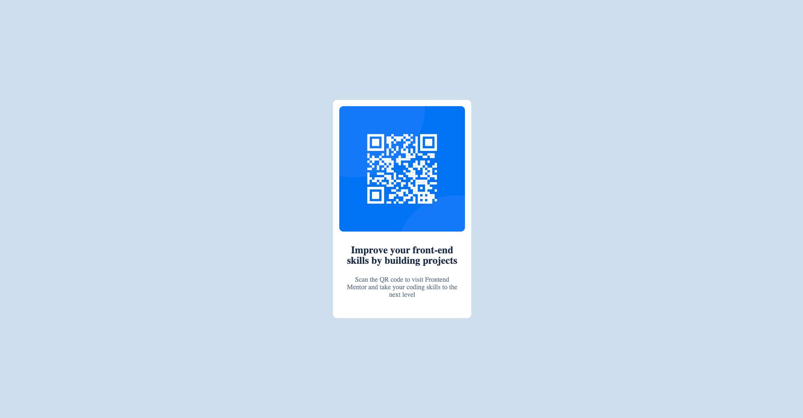

# Frontend Mentor - QR code component solution

This is a solution to the [QR code component challenge on Frontend Mentor](https://www.frontendmentor.io/challenges/qr-code-component-iux_sIO_H). Frontend Mentor challenges help you improve your coding skills by building realistic projects.

## Table of contents

- [Overview](#overview)
  - [Screenshot](#screenshot)
  - [Links](#links)
- [My process](#my-process)
  - [Built with](#built-with)
  - [What I learned](#what-i-learned)
  - [Continued development](#continued-development)
  - [Useful resources](#useful-resources)
- [Author](#author)

## Overview

QR Code Component is implemented by me to practice my frontend skills.

### Screenshot

### Links

- Solution URL: [Add solution URL here](https://www.frontendmentor.io/solutions/qr-code-component-o_IsNB3aop)
- Live Site URL: [Add live site URL here](https://qr-code-component-fm.netlify.app)

## My process

### Built with

- Semantic HTML5 markup
- CSS custom properties
- Flexbox
- CSS Grid

### What I learned

This project helped to brush up my skills on semantic HTML and CSS. Following are some links I found helpful:

1. https://css-tricks.com/snippets/css/complete-guide-grid/
2. https://css-tricks.com/snippets/css/a-guide-to-flexbox/

### Continued development

To improve CSS Grid and Flex skills more to shrpen my skills to build more front end projects in the future.

### Useful resources

- [Setting the height and width of the page](https://greggod.medium.com/css-do-not-put-height-100-on-the-body-html-e36bda3551b3) - This helped me to align the element in the center of the page.
- [Semantic HTML](https://developer.mozilla.org/en-US/docs/Glossary/Semantics#semantics_in_html) - This is Semantic HTML page I used as reference.

## Author

- Website - [QR Code](https://qr-code-component-fm.netlify.app)
- Frontend Mentor - [@yourusername](https://www.frontendmentor.io/profile/niv16)
